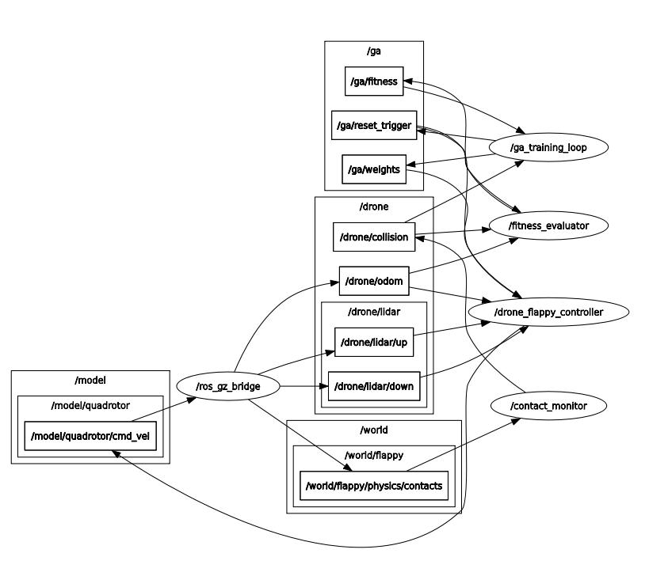

# Flappy Bird Bot 3D

Simulasi quadrotor otonom yang belajar menavigasi rintangan ala Flappy Bird menggunakan Genetic Algorithm. Proyek ini dibangun di atas ROS 2 Humble dan Gazebo Fortress.

## Group Members

| Name | NRP |
|------|-----|
| Muhammad Ammar Ghifari | 5025231109 |
| Glenn Muhammad Rooney | 5025231112 |
| Muhamad Baihaqi Dawanis | 5025231177 |
| Muhammad Risyad Himawan Putra | 5025231205 |
| Naswan Nashir Ramadhan | 5025231246 |
| Faizal Aldy Armiriawan | 5025231266 |

## Tentang Proyek

Proyek ini mengeksplorasi pendekatan evolutionary computation untuk kontrol drone. Alih-alih merancang controller secara manual atau menggunakan reinforcement learning berbasis neural network, kami menggunakan Genetic Algorithm untuk mengoptimalkan parameter sederhana yang menentukan perilaku terbang drone.

Drone bergerak maju dengan kecepatan konstan dan harus menghindari pipa-pipa vertikal dengan celah yang bervariasi — mirip game Flappy Bird, tapi dalam ruang 3D.

### Pendekatan

Controller menggunakan persamaan linear sederhana:

```
vertical_cmd = w1×lidar_up + w2×lidar_down + w3×altitude + w4
```

Keempat weight (w1..w4) dioptimalkan oleh Genetic Algorithm. Fitness diukur dari seberapa jauh drone dapat terbang sebelum menabrak.

## Persyaratan Sistem

- **OS:** Ubuntu 22.04 LTS
- **ROS 2:** Humble Hawksbill
- **Simulator:** Gazebo Fortress (Ignition)
- **GPU:** Direkomendasikan untuk sensor LiDAR GPU-accelerated

## Instalasi

### 1. Install ROS 2 Humble

```bash
# Setup locale
sudo apt update && sudo apt install locales
sudo locale-gen en_US en_US.UTF-8
sudo update-locale LC_ALL=en_US.UTF-8 LANG=en_US.UTF-8
export LANG=en_US.UTF-8

# Setup sources
sudo apt install software-properties-common
sudo add-apt-repository universe
sudo apt update && sudo apt install curl -y
sudo curl -sSL https://raw.githubusercontent.com/ros/rosdistro/master/ros.key -o /usr/share/keyrings/ros-archive-keyring.gpg
echo "deb [arch=$(dpkg --print-architecture) signed-by=/usr/share/keyrings/ros-archive-keyring.gpg] http://packages.ros.org/ros2/ubuntu $(. /etc/os-release && echo $UBUNTU_CODENAME) main" | sudo tee /etc/apt/sources.list.d/ros2.list > /dev/null

# Install
sudo apt update
sudo apt install ros-humble-desktop
```

### 2. Install Gazebo Fortress & ROS-Gazebo Bridge

```bash
sudo apt install ros-humble-ros-gz
```

### 3. Setup Workspace

```bash
# Buat workspace (jika belum ada)
mkdir -p ~/ros2_ws/src
cd ~/ros2_ws/src

# Clone atau copy project ini
# Pastikan folder flappy-bird-bot-3D ada di dalam src/

# Install dependencies
cd ~/ros2_ws
rosdep install --from-paths src --ignore-src -r -y

# Build
source /opt/ros/humble/setup.bash
colcon build --symlink-install

# Source workspace
source install/setup.bash
```

## Cara Menjalankan

### Training GA (Full Stack)

Menjalankan simulasi lengkap dengan GA training loop:

```bash
source ~/ros2_ws/install/setup.bash
ros2 launch sim_drone_ga training_complete.launch.py
```

Parameter yang bisa dikonfigurasi:

```bash
ros2 launch sim_drone_ga training_complete.launch.py \
    population_size:=30 \
    max_generations:=100 \
    episode_timeout:=30.0 \
    forward_velocity:=1.5
```

### Simulasi Saja (Tanpa GA)

Untuk menjalankan simulasi tanpa training loop (berguna untuk testing manual):

```bash
ros2 launch sim_drone_ga sim_drone_ga.launch.py
```

## Debugging

### Build dengan Debug Symbols

```bash
colcon build --symlink-install --cmake-args -DCMAKE_BUILD_TYPE=Debug
```

### Cek Topic yang Aktif

```bash
# List semua topic
ros2 topic list

# Monitor fitness
ros2 topic echo /ga/fitness

# Monitor collision
ros2 topic echo /drone/collision

# Monitor odometry
ros2 topic echo /drone/odom

# Lihat GA weights yang sedang diuji
ros2 topic echo /ga/weights
```

### Inspect Node

```bash
# List semua node yang aktif
ros2 node list

# Info detail sebuah node
ros2 node info /ga_training_loop
ros2 node info /drone_flappy_controller
```

### Debug dengan Logger Level

Tambahkan logging lebih detail:

```bash
ros2 run drone_ga ga_node.py --ros-args --log-level debug
```

### Gunakan rqt untuk Visualisasi

```bash
# Graph node dan topic
rqt_graph

# Monitor semua topic
rqt
```

### Debug Gazebo

Jika simulasi tidak berjalan dengan benar:

```bash
# Jalankan Gazebo secara terpisah dengan verbosity tinggi
ign gazebo -v 4 $(ros2 pkg prefix drone_world)/share/drone_world/worlds/flappy.sdf
```

### Cek Service World Control

GA menggunakan service untuk reset world:

```bash
# List service
ros2 service list | grep control

# Test manual reset
ign service -s /world/flappy/set_pose \
    --reqtype ignition.msgs.Pose \
    --reptype ignition.msgs.Boolean \
    --timeout 5000 \
    --req 'name: "quadrotor" position: {x: 0.0 y: 0.0 z: 6.0} orientation: {w: 1.0}'
```

## Struktur Proyek

```
flappy-bird-bot-3D/
├── drone_collision/      # Node deteksi tabrakan
├── drone_controller/     # Controller drone dengan GA weights
├── drone_description/    # Model SDF quadrotor
├── drone_fitness/        # Evaluator fitness (jarak tempuh)
├── drone_ga/             # GA training loop (state machine)
├── drone_world/          # World SDF dengan obstacles
└── sim_drone_ga/         # Launch files
```

## Arsitektur Sistem



## Troubleshooting

### Gazebo tidak menampilkan model drone

Pastikan environment variable sudah di-set:

```bash
export IGN_GAZEBO_RESOURCE_PATH=$IGN_GAZEBO_RESOURCE_PATH:$(ros2 pkg prefix drone_description)/share/drone_description/models
```

### Service world control tidak ditemukan

Tunggu beberapa detik setelah Gazebo berjalan. Bridge membutuhkan waktu untuk setup.

### Drone tidak bergerak

1. Pastikan GA weights sudah di-publish: `ros2 topic echo /ga/weights`
2. Cek apakah controller menerima data sensor: `ros2 topic hz /drone/lidar/up`
3. Periksa log controller: cari pesan "Control enabled"

### Collision tidak terdeteksi

Pastikan collision monitor berjalan dan physics contacts di-bridge dengan benar:

```bash
ros2 topic echo /world/flappy/physics/contacts
```

## Status Pengembangan

⚠️ **Proyek ini masih dalam tahap pengembangan aktif.**

Known issues:
- [ ] Tuning GA parameters masih perlu optimasi
- [ ] Kadang terjadi delay pada world reset

## Referensi

- [ROS 2 Humble Documentation](https://docs.ros.org/en/humble/)
- [Gazebo Sim Documentation](https://gazebosim.org/docs/fortress)
- [ros_gz Bridge](https://github.com/gazebosim/ros_gz)

## Lisensi

MIT License
